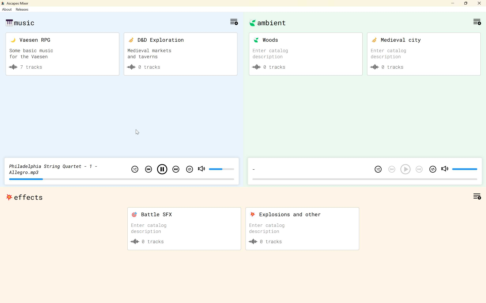

# Ascapes Mixer  

  

## About  

Ascapes Mixer is an audio player and mixer designed for TTRPG actual play, allowing you to control music, ambiance, and sound effects seamlessly during gameplay.  

## Technologies  

- Built with **Svelte 5.x** and **Tauri 2.x**.  

## Features  

- Create and manage playlists for music, ambiance, and sound effects.  
- Add tracks to playlists via drag-and-drop.  
- Manage track aliases and reorder playlists.  
- Control playback with options for repeat, shuffle, and volume adjustments.  
- Mix music, ambiance, and sound effects in three dedicated players.  
- Added tracks are stored in `%localappdata%/ascapes.mixer/audio/`.  
- Playlist metadata is stored in IndexedDB.  

## Known issues

- The application may not work on some versions of macOS.

## Installation  

1. Download the latest installer for your OS from the [Releases](https://github.com/ilyaly/ascapes-mixer/releases) page.  
2. Run the installer and follow the instructions.  
3. Launch the application.

## Development  

Before starting development you have to have a Rust and Node.js installed on your computer.

To set up the development environment, clone the repository and run:  

```bash
npm install
npm run tauri dev
```

## Building

To create a production version of your app:

```bash
npm run tauri build
```
